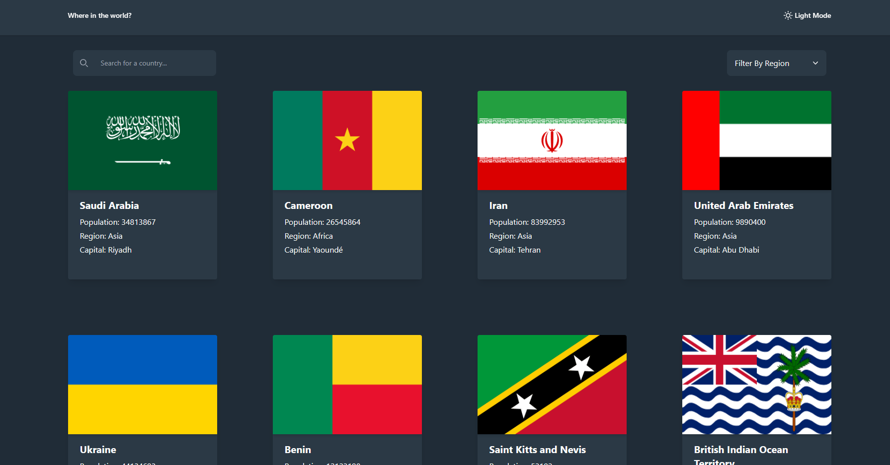
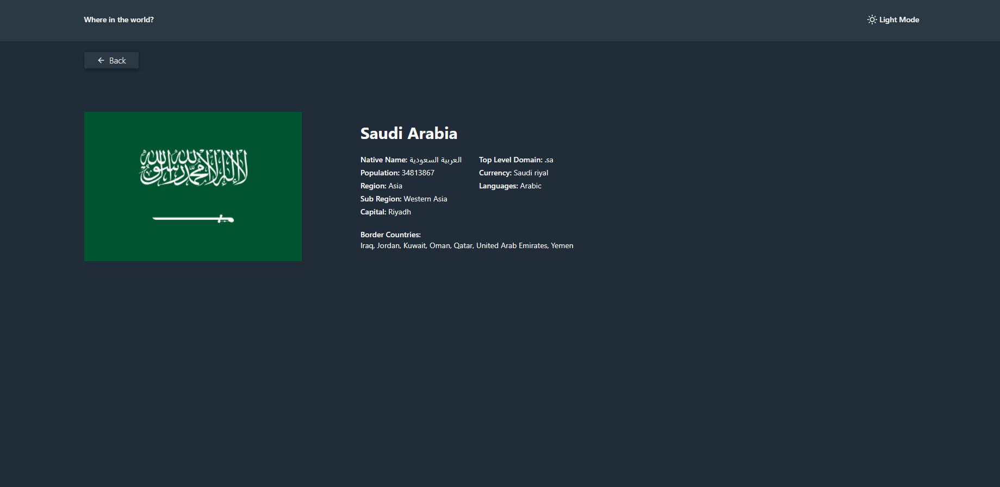
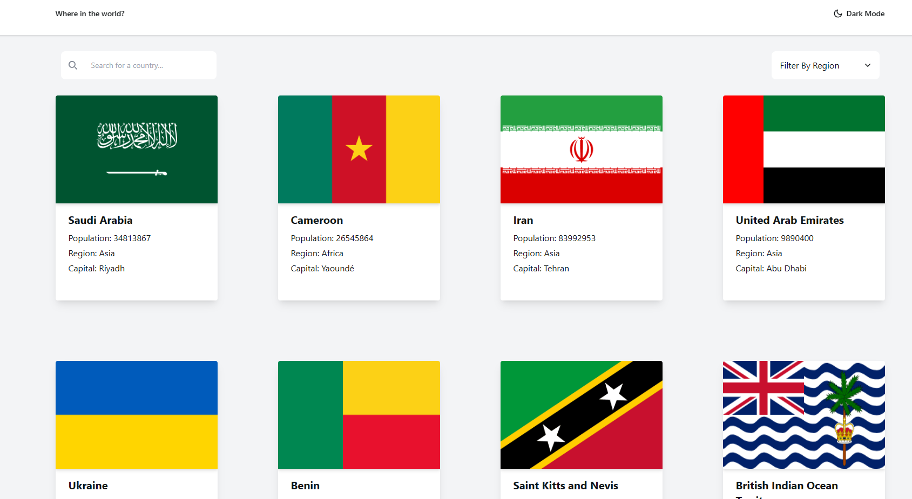
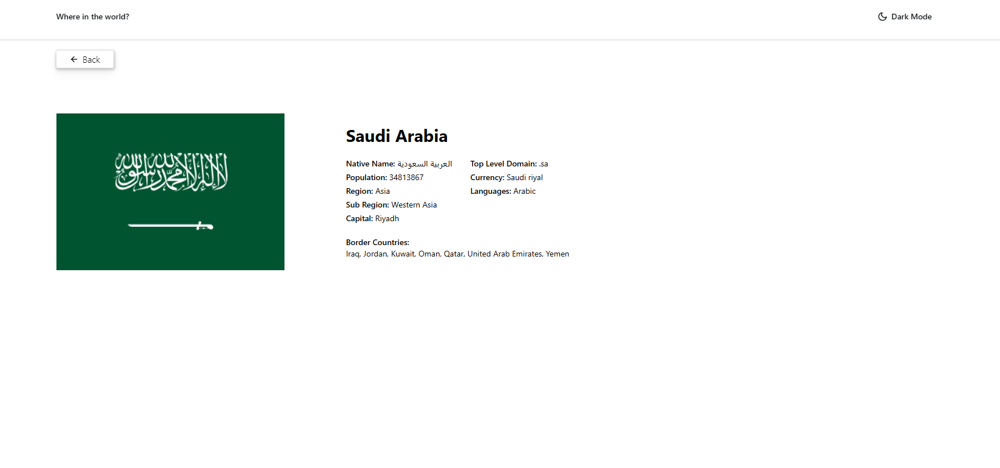
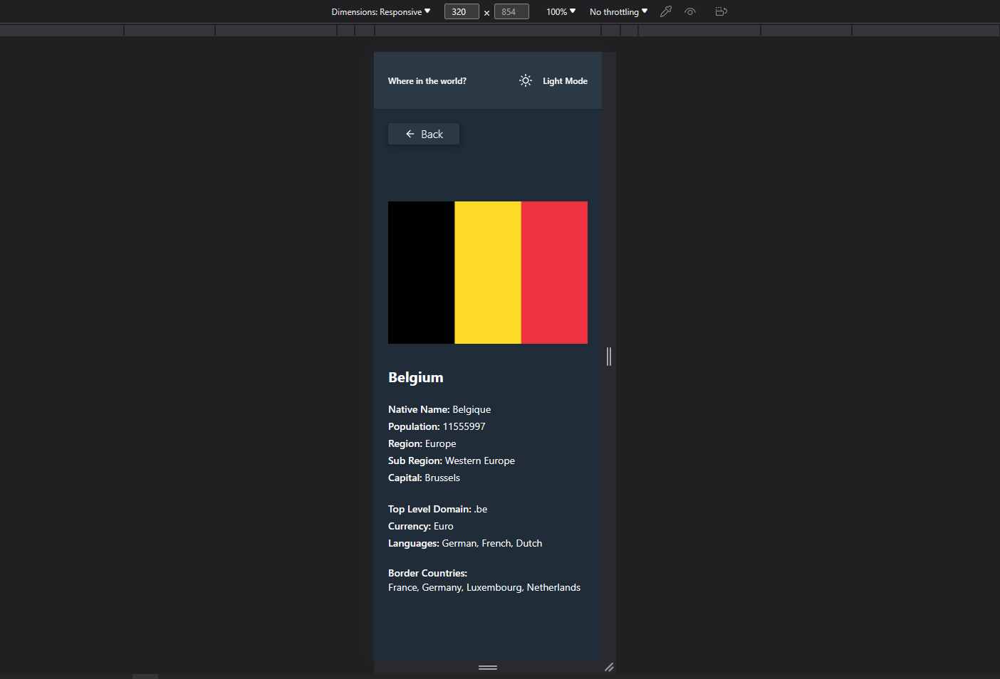
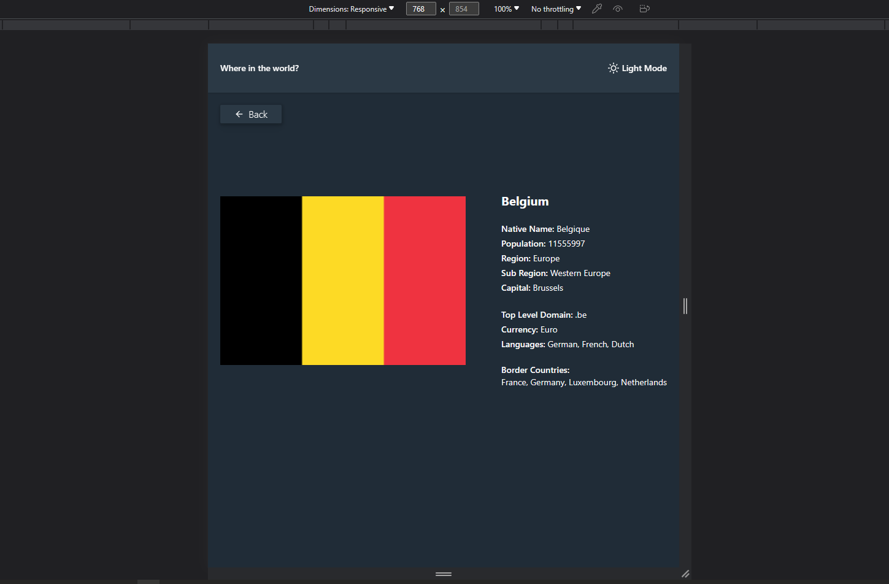

# Frontend Mentor - REST Countries API with color theme switcher solution

This is a solution to the [REST Countries API with color theme switcher challenge on Frontend Mentor](https://www.frontendmentor.io/challenges/rest-countries-api-with-color-theme-switcher-5cacc469fec04111f7b848ca). Frontend Mentor challenges help you improve your coding skills by building realistic projects. 

## Table of contents

- [Overview](#overview)
  - [The challenge](#the-challenge)
  - [Screenshot](#screenshot)
  - [Links](#links)
- [My process](#my-process)
  - [Built with](#built-with)
  - [What I learned](#what-i-learned)
  - [Author](#author)
  - [Acknowledgments](#acknowledgments)

## Overview

### The challenge

Users should be able to:

- See all countries from the API on the homepage
- Search for a country using an `input` field
- Filter countries by region
- Click on a country to see more detailed information on a separate page
- Click through to the border countries on the detail page
- Toggle the color scheme between light and dark mode *(optional)*

### Screenshot








### Links

- https://sulit-countries-api.netlify.app

## My process

### Built with

- Semantic HTML5 markup
- CSS custom properties
- Flexbox
- CSS Grid
- SASS
- Mobile-first workflow
- [React](https://reactjs.org/) - JS library

### What I learned

- From this code, I've learned how to efficiently retrieve a country's common name in a preferred language.
- I created an array `languageCodes` to check different languages and find the corresponding name if available.
```
// Loop through languageCodes to find the common name of the country in the specified language, if available.
  let nativeNameCommon;

  for (const code of languageCodes) {
    if (country.name.nativeName[code]?.common) {
      nativeNameCommon = country.name.nativeName[code]?.common;
      break;
    }
  }
```
- I learned how to create a light and dark theme for a website using tailwind.
```
  useEffect(() => {
    if (theme === 'dark') {
      document.documentElement.classList.add('dark');
    } else {
      document.documentElement.classList.remove('dark');
    }
  }, [theme]);

  const handleThemeSwitch = () => {
    setTheme(theme === 'dark' ? 'light' : 'dark');
  }
```
- In this code, I learned how to use axios to fetch data from a rest api.
- It also helps me to familiarize async/await method.
```
useEffect(() => {
    const fetchData = async () => {
      try {
        const res = await axios.get('https://restcountries.com/v3.1/all/');
        setCountries(res.data);
        setLoading(false);

        //get regions from data
        const uniqueRegions = [...new Set(res.data.map(country => country.region))];
        setRegions(uniqueRegions);
      } catch (error) {
        console.error(error);
        setLoading(false);
      }
    };

    fetchData();
  }, []);
```
## Author

- Website - [Ralph Sulit]
- Frontend Mentor 

## Acknowledgments

ChatGPT
- As a beginner it helped me understand more about coding logic and various programming concepts.
